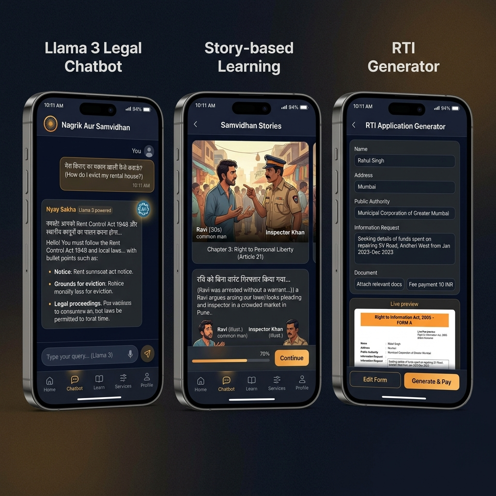
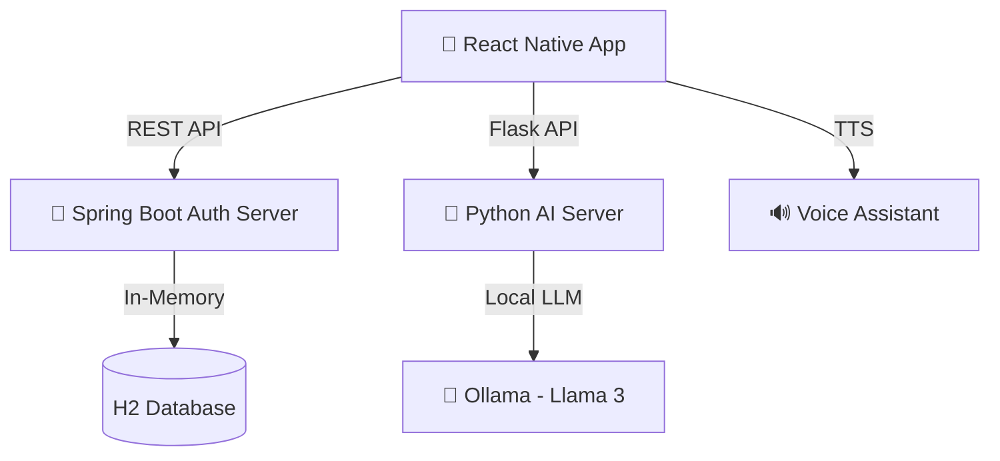

# 🏛️ Nagrik Aur Samvidhan (SIH 2024)

[](https://www.sih.gov.in/)
[](https://reactnative.dev/)
[](https://llama.meta.com/)
[](LICENSE)

**Empowering Indian Citizens through AI-driven Legal Literacy and Justice Accessibility.**

---

## 🌟 App Preview


---

## 🚀 Key Features

### 🤖 1. AI Legal Brain (Llama 3 Integration)
*   **Verdict Predictor**: Predicts potential legal outcomes based on case history.
*   **RTI Generator**: Instant drafting of Right to Information requests in English & Hindi.
*   **Legal Drafting**: Automated generation of legal notices and applications.

### 🎭 2. Interactive Story Engine
*   **Gamified Learning**: Learn your fundamental rights through interactive, scenario-based storytelling.
*   **Multilingual Support**: Switch seamlessly between English and Hindi.

### 🛡️ 3. Safe & Secure
*   **Spring Boot Backend**: Robust authentication and data management.
*   **Privacy First**: Local AI processing via Ollama for sensitive legal queries.

---

## 🏗️ System Architecture



---

## 🛠️ Tech Stack
*   **Frontend**: React Native, React Navigation, Reanimated, Linear Gradient.
*   **Backend**: Spring Boot, Java, H2 Database.
*   **AI Engine**: Flask (Python), Ollama, Llama 3.
*   **Voice**: React Native TTS (Text-to-Speech).

---

## 📦 Installation & Setup

### 1. Prerequisite: Ollama
Download and install [Ollama](https://ollama.com/), then run:
```bash
ollama run llama3
```

### 2. AI Backend (Flask)
```bash
cd ai_backend
pip install flask requests flask-cors
python ai_server.py
```

### 3. Auth Backend (Spring Boot)
```bash
cd auth_backend
./mvnw spring-boot:run
```

### 4. Mobile App
```bash
npm install
npx react-native run-android
```

---

## 📂 Project Structure
*   `src/`: Main React Native application source.
*   `android/`: Native Android project configuration.
*   `dist/`: **Contains the production-ready Signed APK.**
*   `screenshots/`: Visual UI/UX previews.

---

## ⚖️ License
This project is licensed under the MIT License - see the [LICENSE](LICENSE) file for details.

---

**Built with ❤️ for Smart India Hackathon 2024**
